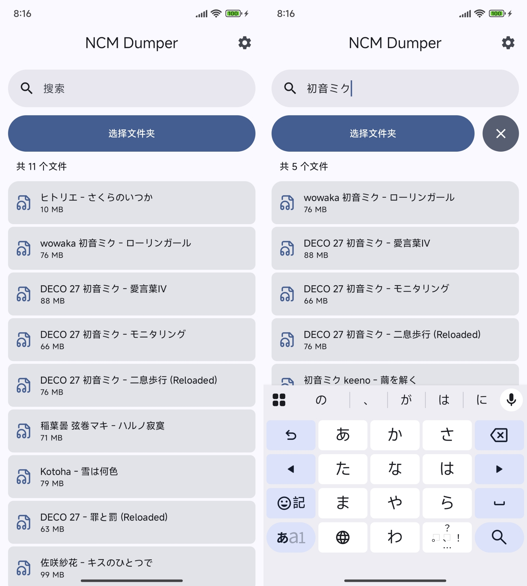
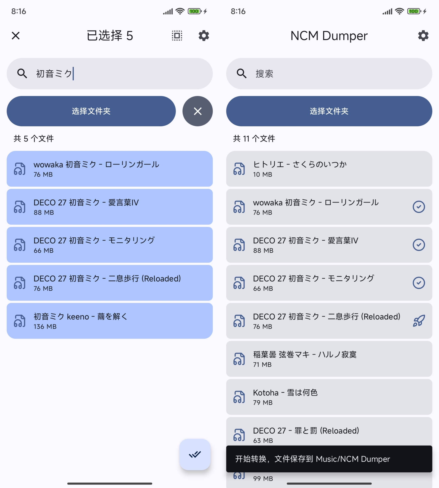

## NCM Dumper Compose

NCM Dumper Compose is an Android app that effortlessly converts protected NCM audio files (from NetEase Cloud Music) to MP3/FLAC formats. 
Built with [Jetpack Compose](https://developer.android.com/jetpack/compose).

## Features:
 - 🎵 One-click conversion
 -  ⚡ Batch processing capabilities
 - 📁 Metadata preservation (artist, album, title, lyrics)
 - 🎨 Intuitive material design interface

## Screenshot:

## Note
Users should only convert files they legally own, in compliance with copyright regulations.

## Credits:

- [Accompanist](https://github.com/google/accompanist)
- [Okhttp](https://github.com/square/okhttp)
- [Taglib](https://github.com/Kyant0/taglib)
- [LucideIcons](https://github.com/lucide-icons)